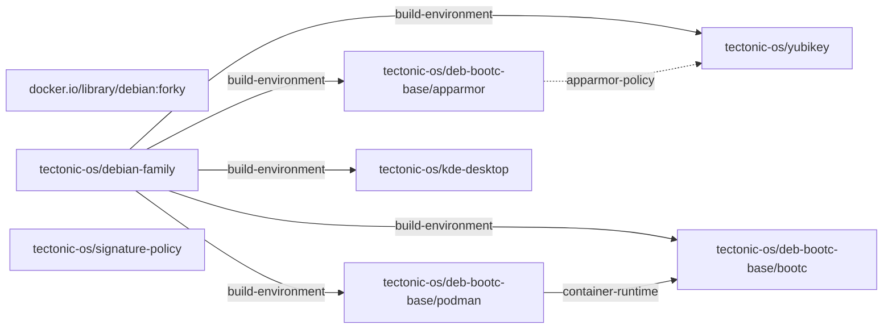

# debian-bootc capability graph

GENERATED FILE, do not edit.

An arrow points from a provider to what needs it, dotted for `after`,
which orders the build without requiring anything. Layers build left to
right.

## Capabilities

| Name | Kind | Provided by | Required by | After |
|---|---|---|---|---|
| `/etc/pki/containers/cosign.pub` | file | `tectonic-os/signature-policy` |  |  |
| `/usr/bin/bootc` | file | `tectonic-os/deb-bootc-base/bootc` |  |  |
| `/usr/bin/bootupctl` | file | `tectonic-os/deb-bootc-base/bootc` |  |  |
| `/usr/bin/crun` | file | `tectonic-os/deb-bootc-base/podman` |  |  |
| `/usr/bin/podman` | file | `tectonic-os/deb-bootc-base/podman` |  |  |
| `/usr/lib/sysimage/dpkg` | file | `tectonic-os/deb-bootc-base/bootc` |  |  |
| `/usr/sbin/sshd` | file | `tectonic-os/deb-bootc-base/bootc` |  |  |
| `apparmor-policy` | capability | `tectonic-os/deb-bootc-base/apparmor` |  | `tectonic-os/yubikey` |
| `bootc-base` | capability | `tectonic-os/deb-bootc-base/bootc` |  |  |
| `build-environment` | capability | `tectonic-os/debian-family` | `tectonic-os/deb-bootc-base/apparmor`, `tectonic-os/deb-bootc-base/podman`, `tectonic-os/deb-bootc-base/bootc`, `tectonic-os/yubikey`, `tectonic-os/kde-desktop` |  |
| `container-runtime` | capability | `tectonic-os/deb-bootc-base/podman` | `tectonic-os/deb-bootc-base/bootc` |  |
| `plasma-desktop` | capability | `tectonic-os/kde-desktop` |  |  |
| `signature-policy` | capability | `tectonic-os/signature-policy` |  |  |
