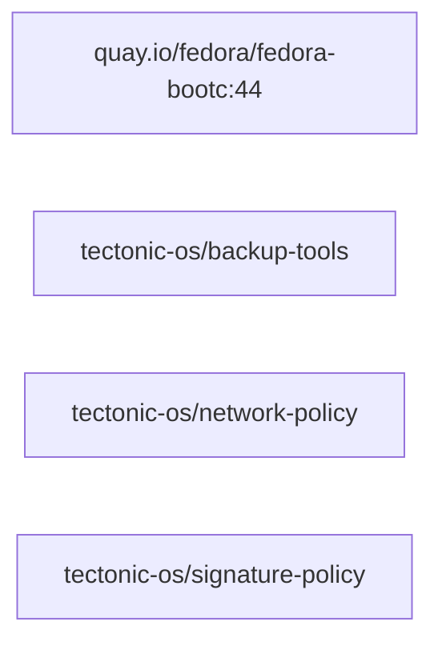

# proving-ground capability graph

GENERATED FILE, do not edit.

An arrow points from a provider to what needs it, dotted for `after`,
which orders the build without requiring anything. Layers build left to
right.

## Capabilities

| Name | Kind | Provided by | Required by | After |
|---|---|---|---|---|
| `/etc/pki/containers/cosign.pub` | file | `tectonic-os/signature-policy` |  |  |
| `initramfs-generation` | capability | `base` |  |  |
| `mac-policy` | capability | `base` |  |  |
| `rechunking` | capability | `base` |  |  |
| `signature-policy` | capability | `tectonic-os/signature-policy` |  |  |
